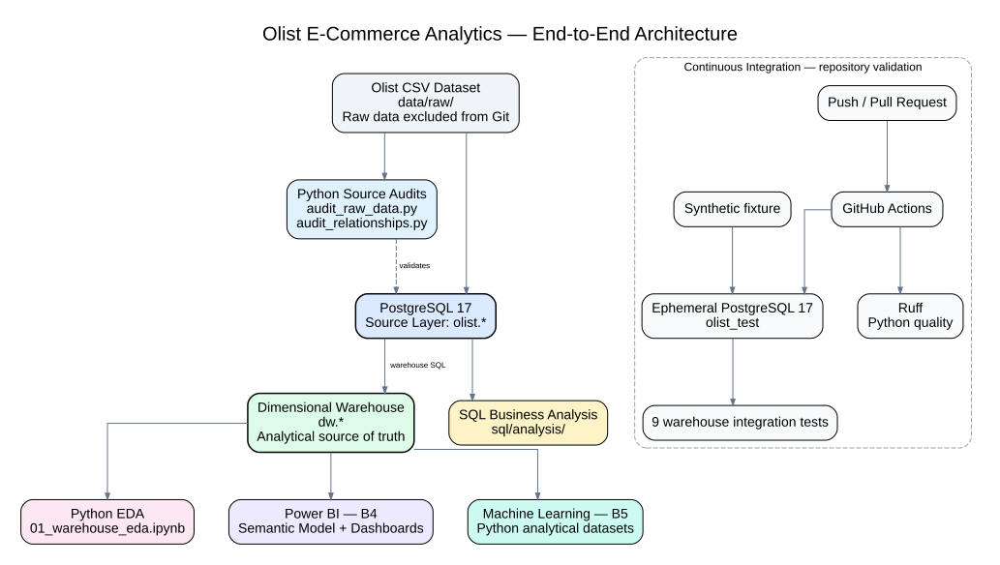
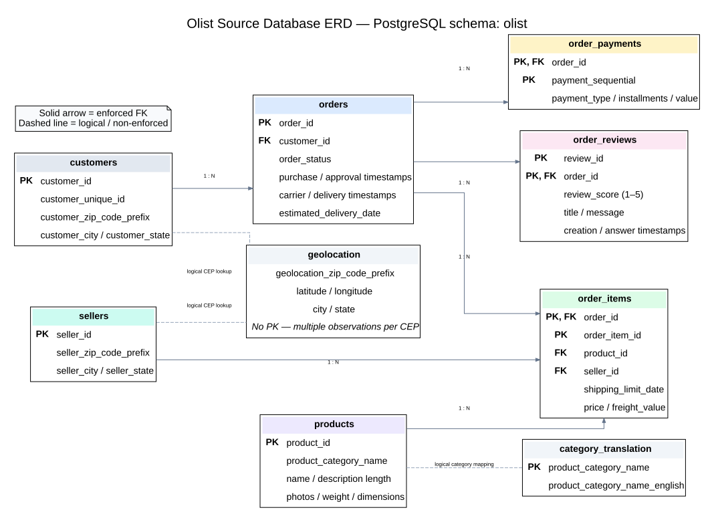
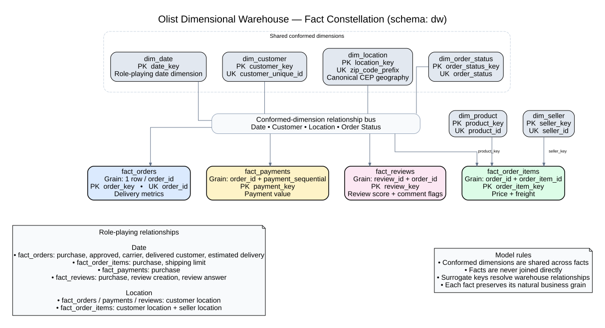
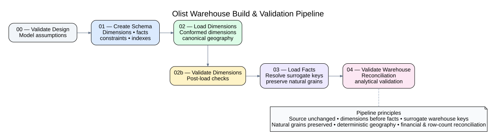

# Olist E-Commerce Analytics

End-to-end analytics and data-science portfolio project built from the Brazilian E-Commerce Public
Dataset by Olist.

The project develops a reproducible path from immutable raw CSV files to PostgreSQL source tables,
SQL business analysis, a dimensional data warehouse, Python exploratory analysis, business
intelligence, and later machine learning.

## Project status

| Phase | Scope                                                             | Status   |
|:------|:------------------------------------------------------------------|:---------|
| B0    | Environment, raw-data audit, source schema, ingestion, validation | Complete |
| B1    | SQL business analysis                                             | Complete |
| B2    | Dimensional modeling and PostgreSQL data warehouse                | Complete |
| B3    | Python exploratory analytics                                      | Complete |
| B3.5  | Architecture, diagrams, testing, and GitHub Actions CI            | Complete |
| B4    | Power BI / business intelligence                                  | Next     |
| B5    | Feature engineering / machine learning                            | Planned  |
| B6    | Final portfolio / production polish                               | Planned  |

## Architecture



The source layer is treated as immutable. Cleaning, geographic canonicalization, derived measures,
and dimensional transformations occur downstream. The PostgreSQL `dw` schema is the common
analytical source for Python, Power BI, and later machine-learning workloads.

### Source database



The source schema preserves the Olist business entities. Solid relationships in the ERD are enforced
foreign keys; dashed relationships are useful logical mappings that are deliberately not enforced in
the source layer.

### Dimensional warehouse



The warehouse is a fact constellation with six conformed dimensions and four facts at different
natural grains. Facts share dimensions and are not joined directly to one another.

### Warehouse pipeline



Warehouse construction is deterministic: design validation → schema creation → dimension loading →
dimension validation → fact loading → final reconciliation and analytical validation.

For the complete architectural rationale, role-playing dimensions, geographic modeling, and CI
boundary, see [`docs/B3_5_system_architecture.md`](docs/B3_5_system_architecture.md).

## Technology

- PostgreSQL 17
- Docker / Docker Compose
- SQL
- Python
- pandas
- Jupyter
- Git / GitHub
- GitHub Actions
- pytest
- Ruff
- Power BI (B4)

## Continuous Integration

GitHub Actions validates the repository on pushes and pull requests to `main`.

The CI workflow:

- runs Ruff against `src` and `tests`;
- starts an ephemeral PostgreSQL 17 service;
- loads a deterministic synthetic source fixture;
- executes the real warehouse SQL pipeline;
- runs nine warehouse integration tests covering fact grains, conformed dimensions, geographic
  canonicalization/fallback behavior, untranslated categories, multi-review preservation, delivery
  derivations, financial reconciliation, and review flags.

The CI database is disposable and independent of the local persistent Olist database. The project
currently implements **CI**, not Continuous Deployment.

## Repository structure

``` text
olist-ecommerce-analytics/
├── .github/
│   └── workflows/
│       └── ci.yml
├── data/
│   ├── raw/                  # ignored raw source files
│   ├── processed/
│   └── README.md
├── sql/
│   ├── schema/
│   ├── ingestion/
│   ├── analysis/
│   └── warehouse/
│       ├── 00_validate_dimensional_design.sql
│       ├── 01_create_warehouse_schema.sql
│       ├── 02_load_dimensions.sql
│       ├── 02b_validate_loaded_dimensions.sql
│       ├── 03_load_facts.sql
│       └── 04_validate_warehouse.sql
├── notebooks/
│   └── 01_warehouse_eda.ipynb
├── src/
├── tests/
│   ├── fixtures/
│   │   └── ci_seed.sql
│   └── test_warehouse_integration.py
├── docs/
│   ├── diagrams/
│   │   ├── source_database_erd.dot
│   │   ├── source_database_erd.svg
│   │   ├── warehouse_model.dot
│   │   ├── warehouse_model.svg
│   │   ├── system_architecture.dot
│   │   ├── system_architecture.svg
│   │   ├── warehouse_pipeline.dot
│   │   └── warehouse_pipeline.svg
│   ├── data_dictionary.md
│   ├── B1_sql_business_analysis.md
│   ├── B2_dimensional_model.md
│   ├── B2_warehouse_data_dictionary.md
│   ├── B2_warehouse_validation.md
│   ├── B3_python_eda_findings.md
│   └── B3_5_system_architecture.md
├── docker-compose.yml
├── pyproject.toml
├── requirements-ci.txt
├── requirements.txt
└── README.md
```

## Source data

Nine Olist source tables are loaded into PostgreSQL.

| Table                |      Rows |
|:---------------------|----------:|
| customers            |    99,441 |
| geolocation          | 1,000,163 |
| order_items          |   112,650 |
| order_payments       |   103,886 |
| order_reviews        |    99,224 |
| orders               |    99,441 |
| products             |    32,951 |
| sellers              |     3,095 |
| category_translation |        71 |

Five-digit Brazilian CEP prefixes are stored as character identifiers so leading zeroes remain
significant.

## B1 — SQL business analysis

The comparable business-analysis period is January 2017 through August 2018, generally using
delivered orders.

The SQL analysis covers:

- orders, revenue, freight, AOV, and monthly trends;
- product-category and seller performance;
- customer identity, repeat purchasing, and geography;
- delivery performance and customer satisfaction.

Examples of validated findings include:

- November 2017 delivered orders increased 62.77% month over month while merchandise revenue
  increased 52.37%, with AOV decreasing from approximately R\$144.76 to R\$135.51.
- `health_beauty`, `watches_gifts`, and `bed_bath_table` are the three largest categories by
  delivered merchandise revenue.
- Repeat purchasing is uncommon in the observed period: approximately 3% of persistent customers
  have multiple delivered purchases.
- Late deliveries are strongly associated with lower submitted review scores: 2.57 stars on average
  versus 4.30 for on-time or early deliveries.

These are descriptive historical associations; the dataset does not establish causal effects.

## B2 — Dimensional data warehouse

The warehouse uses a fact constellation with conformed dimensions rather than a single flattened
table.

### Dimensions

- `dw.dim_date` — one calendar date
- `dw.dim_customer` — one persistent `customer_unique_id`
- `dw.dim_location` — one five-digit CEP prefix
- `dw.dim_product` — one product
- `dw.dim_seller` — one seller
- `dw.dim_order_status` — one order status

### Facts

- `dw.fact_orders` — one row per order
- `dw.fact_order_items` — one row per `(order_id, order_item_id)`
- `dw.fact_payments` — one row per `(order_id, payment_sequential)`
- `dw.fact_reviews` — one raw review event per `(review_id, order_id)`

`order_id` is retained as a degenerate business identifier. Facts share dimensions and are not
modeled with fact-to-fact foreign keys.

### Geographic modeling

Raw geolocation contains many observations per CEP prefix, so it cannot safely be joined directly as
a one-row-per-location dimension.

The warehouse:

1. preserves CEP prefixes as five-character identifiers;
2. performs deterministic lexical city normalization;
3. selects the modal normalized `(city, state)` pair per prefix;
4. uses deterministic lexical tie-breaking;
5. stores median latitude and longitude per geolocation prefix;
6. retains ambiguity/provenance metadata;
7. creates fallback location members for customer/seller prefixes absent from geolocation.

Final `dim_location` contains 19,177 members: 19,015 geolocation-backed prefixes and 162 fallback
prefixes. Pair-level ambiguity is explicitly flagged for 518 geolocation prefixes.

### Review modeling

Reviews are not collapsed to one row per order. The source contains 99,224 review rows for 98,673
reviewed orders; 547 orders have multiple reviews and 202 of those have differing scores. The
warehouse therefore preserves the atomic review-event grain.

## B3 — Python exploratory analysis

The primary notebook is [`notebooks/01_warehouse_eda.ipynb`](notebooks/01_warehouse_eda.ipynb).

B3 consumes the validated `dw` warehouse rather than rebuilding source relationships in pandas. The
executed notebook preserves its analytical outputs for direct review on GitHub.

The documented findings are in [`docs/B3_python_eda_findings.md`](docs/B3_python_eda_findings.md).

## Warehouse validation

B2 final validation passed:

- source-to-warehouse fact row differences: 0;
- natural-grain duplicate groups: 0;
- tested dimensional orphan rows: 0;
- invalid date-key mappings: 0;
- invalid derived delivery calculations: 0;
- merchandise-price difference from source: R\$0.00;
- freight difference from source: R\$0.00;
- payment-value difference from source: R\$0.00;
- invalid review scores/comment flags: 0.

Warehouse analytical smoke tests also reproduce the established B1 revenue, category, and
delivery/satisfaction results.

See [`docs/B2_warehouse_validation.md`](docs/B2_warehouse_validation.md) for the validation record.

## Rebuilding the warehouse

With the PostgreSQL container running and the source `olist` schema already loaded:

``` powershell
Get-Content sql/warehouse/00_validate_dimensional_design.sql |
    docker exec -i olist_postgres psql -v ON_ERROR_STOP=1 -U olist -d olist

Get-Content sql/warehouse/01_create_warehouse_schema.sql |
    docker exec -i olist_postgres psql -v ON_ERROR_STOP=1 -U olist -d olist

Get-Content sql/warehouse/02_load_dimensions.sql |
    docker exec -i olist_postgres psql -v ON_ERROR_STOP=1 -U olist -d olist

Get-Content sql/warehouse/02b_validate_loaded_dimensions.sql |
    docker exec -i olist_postgres psql -v ON_ERROR_STOP=1 -U olist -d olist

Get-Content sql/warehouse/03_load_facts.sql |
    docker exec -i olist_postgres psql -v ON_ERROR_STOP=1 -U olist -d olist

Get-Content sql/warehouse/04_validate_warehouse.sql |
    docker exec -i olist_postgres psql -v ON_ERROR_STOP=1 -U olist -d olist
```

## Documentation

- [`docs/data_dictionary.md`](docs/data_dictionary.md) — immutable source-layer data dictionary and
  data-quality notes
- [`docs/B1_sql_business_analysis.md`](docs/B1_sql_business_analysis.md) — SQL business analysis and
  findings
- [`docs/B2_dimensional_model.md`](docs/B2_dimensional_model.md) — dimensional-model design and
  modeling decisions
- [`docs/B2_warehouse_data_dictionary.md`](docs/B2_warehouse_data_dictionary.md) — warehouse grains
  and field semantics
- [`docs/B2_warehouse_validation.md`](docs/B2_warehouse_validation.md) — final warehouse validation
  record
- [`docs/B3_python_eda_findings.md`](docs/B3_python_eda_findings.md) — Python EDA findings
- [`docs/B3_5_system_architecture.md`](docs/B3_5_system_architecture.md) — end-to-end architecture,
  data modeling, and CI design
- [`docs/diagrams/`](docs/diagrams/) — editable Graphviz sources and rendered SVG architecture
  diagrams

## Next phase

B4 builds the Power BI semantic model and dashboard suite directly from the validated PostgreSQL
`dw` warehouse.
