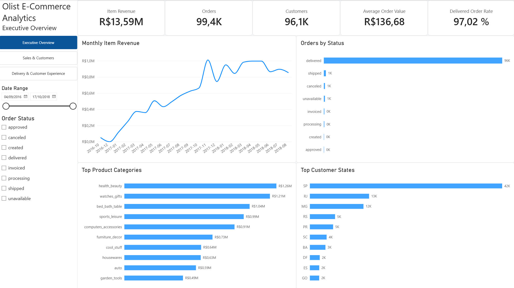
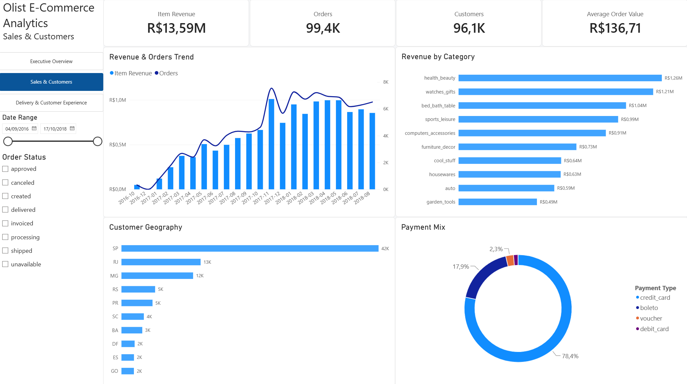

# Olist E-Commerce Analytics

End-to-end analytics and data-science portfolio project built from the
Brazilian E-Commerce Public Dataset by Olist.

The project develops a reproducible path from immutable raw CSV files to
PostgreSQL source tables, SQL business analysis, a dimensional data
warehouse, Python exploratory analysis, interactive Power BI reporting,
and later machine learning.

## Project status

  -----------------------------------------------------------------------
  Phase                   Scope                   Status
  ----------------------- ----------------------- -----------------------
  Phase 0                 Environment, raw-data   Complete
                          audit, source schema,   
                          ingestion, validation   

  Phase 1                 SQL business analysis   Complete

  Phase 2                 Dimensional modeling    Complete
                          and PostgreSQL data     
                          warehouse               

  Phase 3                 Python exploratory      Complete
                          analytics               

  Phase 4                 Architecture, diagrams, Complete
                          testing, and GitHub     
                          Actions CI              

  Phase 5                 Power BI / business     Complete
                          intelligence            

  Phase 6                 Feature engineering /   Next
                          machine learning        

  Phase 7                 Final portfolio /       Planned
                          production polish       
  -----------------------------------------------------------------------

## Architecture


The source layer is treated as immutable. Cleaning, geographic
canonicalization, derived measures, and dimensional transformations
occur downstream. The PostgreSQL `dw` schema is the common analytical
source for Python, Power BI, and later machine-learning workloads.

### Source database


The source schema preserves the Olist business entities. Solid
relationships in the ERD are enforced foreign keys; dashed relationships
are useful logical mappings that are deliberately not enforced in the
source layer.

### Dimensional warehouse


The warehouse is a fact constellation with six conformed dimensions and
four facts at different natural grains. Facts share dimensions and are
not joined directly to one another.

### Warehouse pipeline


Warehouse construction is deterministic: design validation → schema
creation → dimension loading → dimension validation → fact loading →
final reconciliation and analytical validation.

For the complete architectural rationale, role-playing dimensions,
geographic modeling, and CI boundary, see
[`docs/phase_4_system_architecture.md`](docs/phase_4_system_architecture.md).

## Technology

-   PostgreSQL 17
-   Docker / Docker Compose
-   SQL
-   Python
-   pandas
-   Jupyter
-   Power BI
-   DAX
-   Git / GitHub
-   GitHub Actions
-   pytest
-   Ruff

## Continuous Integration

GitHub Actions validates the repository on pushes and pull requests to
`main`.

The CI workflow:

-   runs Ruff against `src` and `tests`;
-   runs focused Python unit tests for raw-data audit behavior and
    database configuration;
-   starts an ephemeral PostgreSQL 17 service;
-   loads a deterministic synthetic source fixture;
-   executes the real warehouse SQL pipeline;
-   runs warehouse integration tests covering fact grains, conformed
    dimensions, geographic canonicalization/fallback behavior,
    untranslated categories, multi-review preservation, delivery
    derivations, financial reconciliation, and review flags;
-   lints tracked Markdown files with PyMarkdown.

The CI database is disposable and independent of the local persistent
Olist database. The project currently implements **CI**, not Continuous
Deployment.

## Repository structure

``` text
olist-ecommerce-analytics/
├── .github/
│   └── workflows/
│       └── ci.yml
├── data/
│   ├── raw/                  # ignored raw source files
│   ├── processed/
│   └── README.md
├── sql/
│   ├── schema/
│   ├── ingestion/
│   ├── analysis/
│   └── warehouse/
│       ├── 00_validate_dimensional_design.sql
│       ├── 01_create_warehouse_schema.sql
│       ├── 02_load_dimensions.sql
│       ├── 02b_validate_loaded_dimensions.sql
│       ├── 03_load_facts.sql
│       └── 04_validate_warehouse.sql
├── notebooks/
│   └── 01_warehouse_eda.ipynb
├── powerbi/
│   └── olist_ecommerce_analytics.pbix
├── src/
├── tests/
│   ├── fixtures/
│   │   └── ci_seed.sql
│   ├── test_audit_raw_data.py
│   ├── test_database.py
│   └── test_warehouse_integration.py
├── docs/
│   ├── diagrams/
│   ├── figures/
│   │   └── powerbi/
│   │       ├── executive_overview.png
│   │       ├── sales_customers.png
│   │       └── delivery_customer_experience.png
│   ├── data_dictionary.md
│   ├── phase_1_sql_business_analysis.md
│   ├── phase_2_dimensional_model.md
│   ├── phase_2_warehouse_data_dictionary.md
│   ├── phase_2_warehouse_validation.md
│   ├── phase_3_python_eda_findings.md
│   ├── phase_4_system_architecture.md
│   └── phase_5_power_bi.md
├── docker-compose.yml
├── pyproject.toml
├── requirements-ci.txt
├── requirements.txt
└── README.md
```

## Getting Started

### Prerequisites

-   Git
-   Python 3.11 or later
-   Docker Desktop with Docker Compose
-   Power BI Desktop to open the interactive report

### 1. Clone and configure the Python environment

From the repository root in PowerShell:

``` powershell
python -m venv .venv
.\.venv\Scripts\Activate.ps1
python -m pip install --upgrade pip
pip install -r requirements.txt
pip install -e .
```

Copy the environment template:

``` powershell
Copy-Item .env.example .env
```

The default values in `.env.example` match the local PostgreSQL service
defined in `docker-compose.yml`.

### 2. Add the raw Olist data

Download the [Brazilian E-Commerce Public Dataset by
Olist](https://www.kaggle.com/datasets/olistbr/brazilian-ecommerce) from
Kaggle and place the nine required CSV files in `data/raw/` without
renaming them. The exact filenames and data-directory contract are
documented in [`data/README.md`](data/README.md).

Raw and processed data are intentionally excluded from Git.

### 3. Start PostgreSQL

``` powershell
docker compose up -d
docker compose ps
```

Docker Compose mounts `data/raw/` read-only at `/tmp/olist_raw` inside
the PostgreSQL container, which is the path used by the ingestion
script.

### 4. Create and load the source schema

``` powershell
Get-Content -Raw sql/schema/01_create_source_schema.sql |
    docker compose exec -T postgres psql -v ON_ERROR_STOP=1 -U olist -d olist

Get-Content -Raw sql/ingestion/01_load_raw_data.sql |
    docker compose exec -T postgres psql -v ON_ERROR_STOP=1 -U olist -d olist
```

Validate the loaded source layer:

``` powershell
Get-Content -Raw sql/analysis/00_validate_source.sql |
    docker compose exec -T postgres psql -v ON_ERROR_STOP=1 -U olist -d olist

python src/audit_raw_data.py
python src/audit_relationships.py
```

The expected source-table row counts are listed in the [Source
data](#source-data) section below.

### 5. Build and validate the warehouse

Run the six warehouse scripts in filename order:

``` powershell
Get-Content -Raw sql/warehouse/00_validate_dimensional_design.sql |
    docker compose exec -T postgres psql -v ON_ERROR_STOP=1 -U olist -d olist

Get-Content -Raw sql/warehouse/01_create_warehouse_schema.sql |
    docker compose exec -T postgres psql -v ON_ERROR_STOP=1 -U olist -d olist

Get-Content -Raw sql/warehouse/02_load_dimensions.sql |
    docker compose exec -T postgres psql -v ON_ERROR_STOP=1 -U olist -d olist

Get-Content -Raw sql/warehouse/02b_validate_loaded_dimensions.sql |
    docker compose exec -T postgres psql -v ON_ERROR_STOP=1 -U olist -d olist

Get-Content -Raw sql/warehouse/03_load_facts.sql |
    docker compose exec -T postgres psql -v ON_ERROR_STOP=1 -U olist -d olist

Get-Content -Raw sql/warehouse/04_validate_warehouse.sql |
    docker compose exec -T postgres psql -v ON_ERROR_STOP=1 -U olist -d olist
```

### 6. Run the analytical notebook

The Phase 3 notebook is stored with its executed outputs for direct
GitHub review. To explore or rerun it locally:

``` powershell
jupyter notebook notebooks/01_warehouse_eda.ipynb
```

The notebook reads from the validated PostgreSQL `dw` schema through
`src/database.py`.

### 7. Open the Power BI report

The completed interactive report is stored at:

[`powerbi/olist_ecommerce_analytics.pbix`](powerbi/olist_ecommerce_analytics.pbix)

Power BI Desktop is required to open the `.pbix` file. Static
screenshots of all three report pages are included in
`docs/figures/powerbi/` for direct review on GitHub.

### Reproducibility boundary

The repository contains the source schema, ingestion logic, warehouse
pipeline, analytical code, tests, documentation, CI configuration, and
Power BI report. The original Olist CSV files are intentionally not
versioned, so a fresh local rebuild requires obtaining those files
separately and placing them in `data/raw/`.

GitHub Actions uses a deterministic synthetic fixture instead of the
full Olist dataset. This keeps CI independent of local raw data while
exercising the real warehouse SQL pipeline.

## Source data

**Dataset:** [Brazilian E-Commerce Public Dataset by
Olist](https://www.kaggle.com/datasets/olistbr/brazilian-ecommerce)

**Source:** Kaggle

**Dataset license:** CC BY-NC-SA 4.0

The original dataset is provided by Olist and is not redistributed in
this repository. Its licensing terms are separate from the MIT license
that applies to this repository's code. Download the nine source CSV
files from the Kaggle dataset page and place them in `data/raw/`.

Nine Olist source tables are loaded into PostgreSQL.

  Table                         Rows
  ---------------------- -----------
  customers                   99,441
  geolocation              1,000,163
  order_items                112,650
  order_payments             103,886
  order_reviews               99,224
  orders                      99,441
  products                    32,951
  sellers                      3,095
  category_translation            71

Five-digit Brazilian CEP prefixes are stored as character identifiers so
leading zeroes remain significant.

## Phase 1 --- SQL business analysis

The comparable business-analysis period is January 2017 through August
2018, generally using delivered orders.

The SQL analysis covers:

-   orders, revenue, freight, AOV, and monthly trends;
-   product-category and seller performance;
-   customer identity, repeat purchasing, and geography;
-   delivery performance and customer satisfaction.

Examples of validated findings include:

-   November 2017 delivered orders increased 62.77% month over month
    while merchandise revenue increased 52.37%, with AOV decreasing from
    approximately R\$144.76 to R\$135.51.
-   `health_beauty`, `watches_gifts`, and `bed_bath_table` are the three
    largest categories by delivered merchandise revenue.
-   Repeat purchasing is uncommon in the observed period: approximately
    3% of persistent customers have multiple delivered purchases.
-   Late deliveries are strongly associated with lower submitted review
    scores: 2.57 stars on average versus 4.30 for on-time or early
    deliveries.

These are descriptive historical associations; the dataset does not
establish causal effects.

## Phase 2 --- Dimensional data warehouse

The warehouse uses a fact constellation with conformed dimensions rather
than a single flattened table.

### Dimensions

-   `dw.dim_date` --- one calendar date
-   `dw.dim_customer` --- one persistent `customer_unique_id`
-   `dw.dim_location` --- one five-digit CEP prefix
-   `dw.dim_product` --- one product
-   `dw.dim_seller` --- one seller
-   `dw.dim_order_status` --- one order status

### Facts

-   `dw.fact_orders` --- one row per order
-   `dw.fact_order_items` --- one row per `(order_id, order_item_id)`
-   `dw.fact_payments` --- one row per `(order_id, payment_sequential)`
-   `dw.fact_reviews` --- one raw review event per
    `(review_id, order_id)`

`order_id` is retained as a degenerate business identifier. Facts share
dimensions and are not modeled with fact-to-fact foreign keys.

### Geographic modeling

Raw geolocation contains many observations per CEP prefix, so it cannot
safely be joined directly as a one-row-per-location dimension.

The warehouse:

1.  preserves CEP prefixes as five-character identifiers;
2.  performs deterministic lexical city normalization;
3.  selects the modal normalized `(city, state)` pair per prefix;
4.  uses deterministic lexical tie-breaking;
5.  stores median latitude and longitude per geolocation prefix;
6.  retains ambiguity/provenance metadata;
7.  creates fallback location members for customer/seller prefixes
    absent from geolocation.

Final `dim_location` contains 19,177 members: 19,015 geolocation-backed
prefixes and 162 fallback prefixes. Pair-level ambiguity is explicitly
flagged for 518 geolocation prefixes.

### Review modeling

Reviews are not collapsed to one row per order. The source contains
99,224 review rows for 98,673 reviewed orders; 547 orders have multiple
reviews and 202 of those have differing scores. The warehouse therefore
preserves the atomic review-event grain.

## Phase 3 --- Python exploratory analysis

The primary notebook is
[`notebooks/01_warehouse_eda.ipynb`](notebooks/01_warehouse_eda.ipynb).

Phase 3 consumes the validated `dw` warehouse rather than rebuilding
source relationships in pandas. The executed notebook preserves its
analytical outputs for direct review on GitHub.

The documented findings are in
[`docs/phase_3_python_eda_findings.md`](docs/phase_3_python_eda_findings.md).

## Phase 4 --- Architecture and CI

Phase 4 documents the end-to-end system architecture and adds automated
quality controls around the analytical pipeline.

The architecture preserves a clear boundary between:

-   immutable raw data;
-   PostgreSQL source tables;
-   dimensional warehouse transformations;
-   Python analytics;
-   Power BI reporting;
-   automated repository and warehouse validation.

GitHub Actions exercises the real warehouse SQL pipeline against a
deterministic disposable test database, while destructive
integration-test setup is isolated from the local persistent Olist
database.

See
[`docs/phase_4_system_architecture.md`](docs/phase_4_system_architecture.md).

## Phase 5 --- Power BI business intelligence

Phase 5 adds an interactive Power BI semantic and reporting layer
directly on top of the validated PostgreSQL `dw` warehouse.



The report contains three coordinated pages:

-   **Executive Overview** --- revenue, orders, customers, AOV,
    fulfillment status, product categories, and customer geography.
-   **Sales & Customers** --- revenue/order trends, category
    performance, geographic order volume, and payment mix.
-   **Delivery & Customer Experience** --- late-delivery performance,
    review-score distribution, geographic delivery performance, and
    customer satisfaction by delivery outcome.

The Power BI model preserves the warehouse fact constellation and
single-direction dimensional filtering. The report adds reusable DAX
measures, role-playing date logic, explicit filter-context handling, and
cross-fact analysis with `TREATAS` where a business question requires
order-level bridging between delivery and review facts.

Two additional report pages are shown below.

### Sales & Customers



### Delivery & Customer Experience


The interactive report is available at
[`powerbi/olist_ecommerce_analytics.pbix`](powerbi/olist_ecommerce_analytics.pbix).

Detailed semantic-model decisions, interaction behavior, validation, and
report-page documentation are in
[`docs/phase_5_power_bi.md`](docs/phase_5_power_bi.md).

## Warehouse validation

Phase 2 final validation passed:

-   source-to-warehouse fact row differences: 0;
-   natural-grain duplicate groups: 0;
-   tested dimensional orphan rows: 0;
-   invalid date-key mappings: 0;
-   invalid derived delivery calculations: 0;
-   merchandise-price difference from source: R\$0.00;
-   freight difference from source: R\$0.00;
-   payment-value difference from source: R\$0.00;
-   invalid review scores/comment flags: 0.

Warehouse analytical smoke tests also reproduce the established Phase 1
revenue, category, and delivery/satisfaction results.

See
[`docs/phase_2_warehouse_validation.md`](docs/phase_2_warehouse_validation.md)
for the validation record.

## Rebuilding the warehouse

The complete fresh-clone workflow is documented in [Getting
Started](#getting-started). If the source `olist` schema is already
loaded, rebuild the warehouse by running the six scripts in
`sql/warehouse/` in filename order from
`00_validate_dimensional_design.sql` through
`04_validate_warehouse.sql`.

## Documentation

-   [`docs/data_dictionary.md`](docs/data_dictionary.md) --- immutable
    source-layer data dictionary and data-quality notes
-   [`docs/phase_1_sql_business_analysis.md`](docs/phase_1_sql_business_analysis.md)
    --- SQL business analysis and findings
-   [`docs/phase_2_dimensional_model.md`](docs/phase_2_dimensional_model.md)
    --- dimensional-model design and modeling decisions
-   [`docs/phase_2_warehouse_data_dictionary.md`](docs/phase_2_warehouse_data_dictionary.md)
    --- warehouse grains and field semantics
-   [`docs/phase_2_warehouse_validation.md`](docs/phase_2_warehouse_validation.md)
    --- final warehouse validation record
-   [`docs/phase_3_python_eda_findings.md`](docs/phase_3_python_eda_findings.md)
    --- Python EDA findings
-   [`docs/phase_4_system_architecture.md`](docs/phase_4_system_architecture.md)
    --- end-to-end architecture, data modeling, and CI design
-   [`docs/phase_5_power_bi.md`](docs/phase_5_power_bi.md) --- Power BI
    semantic model, report design, DAX/filter-context decisions, and
    validation
-   [`docs/diagrams/`](docs/diagrams/) --- editable Graphviz sources and
    rendered SVG architecture diagrams
-   [`docs/figures/powerbi/`](docs/figures/powerbi/) --- static
    screenshots of the completed Power BI report

## Next phase

Phase 6 extends the analytical foundation into feature engineering and
machine learning. Model development will build on the validated source,
warehouse, and exploratory findings rather than reconstructing the data
pipeline independently.
